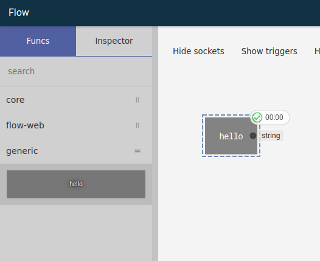
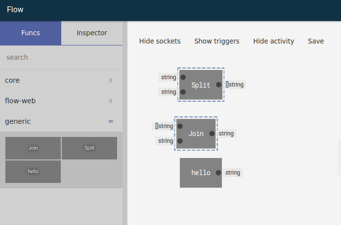
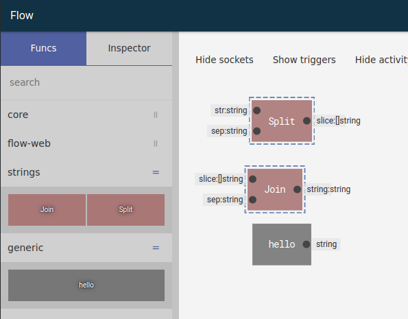
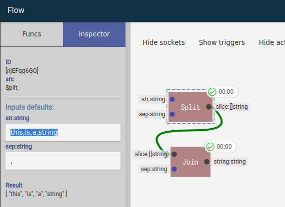
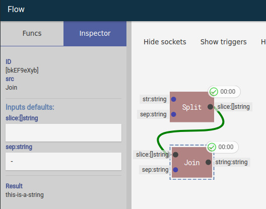

# Flow

General purpose graph package for Go

[changelog](#changelog)

## Initial Idea

`possibilities`

* Machine learning
* Graphical CI pipeline

## Flow package

Using flow package without UI

```go
package main

import (
	"flow"
	"flow/registry"
	"log"
	"strings"
)

func main() {

	r := registry.New()
	r.Add(strings.Split, strings.Join)

	f := flow.New()
	f.SetRegistry(r)

	op := f.Op("Join",
		f.Op("Split", "hello world", " "),
		",",
	)

	res, err := op.Process()
	if err != nil {
		log.Fatal(err)
	}
	log.Println("res:", res)

}
```

## How it works

A flow works by requesting the previous nodes the results of its operation,
so the starting node will be the node we want the result of, unattached nodes wont be executed

### Registering a function

All nodes are Go functions to create a node src simply add a function like:

```go
package main

import (
	"flow/flowserver"
	"flow/registry"
	"net/http"
)

func main() {

	r := registry.New()
	r.Add("hello", func() string {
		return "hello world"
	})

	http.ListenAndServe(":5000", flowserver.New(r, "storename"))

}
```

Resulting in



### Go funcs

Since every node is a function we can register functions from any Go
package

```go
// Adding functions from a go package
r.Add(strings.Split, strings.Join)
```



### Describing funcs

We can describe the inserted functions either by using `r.Add` methods or
grouping functions with the helper `registry.Describer`

```go
// utility to apply functions to several entries
registry.Describer(
	r.Add(strings.Split).Inputs("str", "sep").Output("slice"),
	r.Add(strings.Join).Inputs("slice", "sep").Output("string"),
).Tags("strings").Extra("style", registry.M{"color": "#a77"})
```






## Special Operations

### f.In

Uses an argument passed through the process function

```go
op := f.In(0)
res, err := op.Process("arg")
// res will be "arg"
```

```go
op := f.Op("sum",f.In(0),f.In(1)
res, err := op.Process(1,2)
// res will be the sum the inputs 1 and 2
```

### f.Var

_Var_ creates an operation that loads data from the flow, if there is no data
the second parameter will be used for variable initialization

```go
f.Var("myvar", "initial value or operation")
```

### f.SetVar

_SetVar_ creates an operation that sets a variable to the result of the operation
passed as the argument

```go
f.SetVar("myvar", operation)
```

## UI Special nodes

### Input

Same as f.In where a property must be set to indicate which argument this
node refers to

### Var

Same as f.Var passing the variable name as a property of the node

### SetVar

Same as f.SetVar passing the variable name as a property of the node

### Output

_Deprecated_  
See [here](#actions)

> Flow-UI only

~~Output is a special node that indicates the overall flow output,
the UI contains a RUN button that will be visible if there is an output node and
the flow will be executed from the output node.~~

~~There can be only one output node~~

### Portal From

> Flow-UI only

Portals are helper nodes that allows to connect areas of UI without
crossing any links, right click in a node and choose create portal or drag a
link from an output socket to an empty area, this will create a portal from the
node

---

> WIP

## Ideas/TODOS

### Matching types

> TODO

in UI we can create a state such as draggingType{in:'io.Writer'} which basically
each node can figure a match for each socket

in Server side we can do an analysis on each type to see if it can be
implemented by another type and send this as part of the registry with all
descriptions, this way we can highlight sockets that can implement the dragging
type

### Generating code

> TODO

generate code based on a flow should be simple as we have the function signatures

### Portals

> Testing

~~Named portal would connect a node to another without any link, this way we can
have clean links without crossovers~~

### Recursive registering

> TODO

Since an operation can be run with op.Process(inputs...) we can simple do
registry.Add(op.Process) to register a flow as an operation, UI doesn't retain
the registry/flow yet

### Multiple node editing

> Testing

~~While on multiple selection the inspector can show common properties and editing
those will affect all nodes in the selection, RUN would be disabled in multiple
selection~~

### Dynamic context menu

> TODO

Right now the context menu works while right clicking in a node,
would be good to have the same by right clicking in other subjects:

* **Link**
  * Delete
* **Trigger**
  * toggle On: error
  * toggle On: success
* **Editor**
  * ~~toggle Show Detail~~
  * ~~toggle Show Activity~~
  * ~~toggle Show Triggers~~
  * Reset view

### Actions

> TODO

Instead of having a single Output node that shows the RUN button we would setup
nodes to be processed in an action having possible multiple nodes per action

`something like inspecting node and defining a list of actions that node would be processed such as [TRAIN, MAIN]`

## TODO

### Readme

> this is a simple markdown which is rendered to html during compile time with
> webpack using markdown-loader and highlight-loader, the left menu is generated by analysing
> the html h1,h2,h3,h4 tags

* Fix any typos bad English etc...
* Create an explanation of the project inspiration/goals
* describe milestones

### UX/UI

* UX/UI: Show errors on modal data or inspector
* UX/UI: Create Undo behaviour, Possibly easy since this is using vuex (centralized state management)
* UX/UI: Special visualisers/nodes to display information (images, datatables, graphs);
* UX/UI: Ability to group nodes into a single box exposing inputs and outputs;
* UX/UI: Implement touch;
* UX/UI: Drop link in node to link to the next compatible input;
* UX/UI: Find a way to highlight/linked portals for easy user reference
  ~~\* UX/UI: Multiple selection inspecting [idea](#multiple-node-editing)~~
* UX/UI: Dynamic Context menu (now works on nodes and editor)
* UX/UI: link/node animation synchronization on collaborative environment
* ~~UX/UI: Portals to clean graph crossing~~ (testing);
* ~~UX/UI: `Shift` key to merge group selections~~;

### Packages

* FlowPkg: Create training mechanism;
* FlowPkg: Machine learning examples;
* FlowPkg: Generate go code to maximize call performance;

### Backend

* Backend: Export/Deploy a model to a training cluster;
* Backend: Expose the model possibly via an Rest API for easy function access;
* Backend: Create output for flow-web/flow so we can fetch data for it

### Other

* Collaboration: Better concurrent editing/message passing;
* Flow: Proper documentation;

---

## Changelog

02/Mar/2018

* **UI/UX**: Multi selection inspector
* **UI/UX**: Middle click do remove node disabled

27/Feb/2018

* **UI/UX**: removed SVGMatrix favouring CSSMatrix and manual matrix calculations
  Area now rotates around a point, although this is not really useful
* **UI/UX**: improved selection behaviour
* **UI/UX**: Added context menu for editor area, removed some buttons from top button bar

25/Feb/2018

* **UI/UX**: Added image visualization if the content result is a dataurl
* **UI/UX**: Removed flow-ui Output node source, the button `run` which is now
  Process will process and fetch data from selected nodes

18/Feb/2018

* **frontend**: Refactored nodes and links to improve performance with lots of elements
  * Cleaned up some areas while refactoring, less code
  * Remove dependencies on $refs and DOM elements, nodes now calculate size based on monospace font
  * moved some display logic to respective areas, as nodeProps from editor to node
  * Cached node dimensions for performance

15/Feb/2018

* **Selection**: Added clone using ctrl + drag will clone selected nodes
* **Selection**: Added drag threshold, only start dragging if pointer goes over a threshold value
* **Selection**: Moved selection to vuex state
* **Styling**: Few changes in css for secondary button
* **Inspector**: Added result button to inspector
* **Activity**: Added new activity icon if the node has data

13/Feb/2018

* **Selection**: Animated selection areas to improve visibility
* **Portal node**: dragging from a output socket to an empty area will create a portal
* **Portal node**: Improved backend portal handling
* **Dark**: Improved styling in the dark mode
* **Editor**: Shift now increases zoom speed, added small transition to smooth zoom
